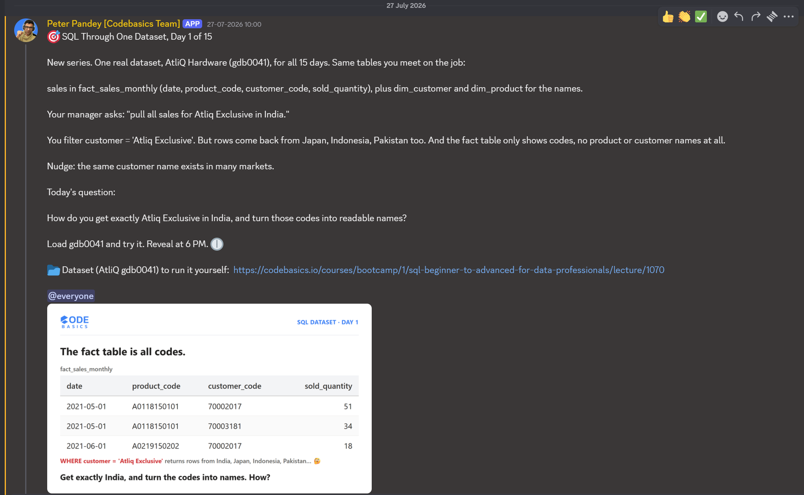

# Day 1 / 15 -- Filtering Across Related Tables

**Dataset:** AtliQ Hardware (`gdb0041`) | **Tool:** MySQL | **Date:** 27/07/2026

[Day_l](./Day-1-fix-query.sql)

---

## The Ask



This is Day 1 of a 15-day series, one real dataset (AtliQ Hardware, `gdb0041`) for all 15 days -- the same tables you'd meet on the job.

The relevant tables:
-- `fact_sales_monthly` -- `date`, `product_code`, `customer_code`, `sold_quantity`
-- `dim_customer` -- lookup table with the customer names and their markets
-- `dim_product` -- lookup table with the product names

The manager's ask: **"Pull all sales for Atliq Exclusive in India."**

## The Trap

The obvious first move is to filter on the customer name alone:

```sql
WHERE dc.customer = 'Atliq Exclusive'
```

This looks right and it runs without error. The problem only shows up in the results. Atliq Exclusive isn't unique to India -- the same customer name operates in Japan and Indonesia too. Filtering on the name alone pulls every market that customer touches, not just the one the manager asked for.

-- Customer names are not scoped to a single market
-- One `WHERE` condition can silently under-specify a request that sounds fully specified in plain English

## The Fix

Filter on both conditions together, not just one:

```sql
WHERE dc.customer = 'Atliq Exclusive' 
  AND dc.market = 'India'
```

Now the result set is scoped to exactly what was asked -- one customer, one market.

## A Second Problem: No Names in the Fact Table

Even with the filter fixed, there's a second issue. `fact_sales_monthly` only holds:

`date | fiscal_year | product_code | customer_code | sold_quantity`

There's no `customer_name` or `product_name` column in this table at all. Query it alone and the output is unreadable -- just codes.

## Why Joins Solve This

Think of it like a person holding two passports. In India, an Indian citizen with a foreign passport is a foreigner; in the UK, the same person is a citizen there and a foreigner back home. The country changes the label, but the person connecting both records is the same.

Same idea here: `product_code` and `customer_code` are the shared keys that connect the fact table to the dimension tables. Join on them, and the codes resolve into readable names.

```sql
JOIN gdb0041.dim_customer dc
    ON dc.customer_code = fs.customer_code
JOIN gdb0041.dim_product dp
    ON dp.product_code = fs.product_code
```

## Fix Query

```sql
SELECT 
    fs.date, 
    dp.product,
    dc.customer,
    dc.market, 
    fs.sold_quantity
FROM gdb0041.fact_sales_monthly fs
JOIN gdb0041.dim_customer dc
    ON dc.customer_code = fs.customer_code
JOIN gdb0041.dim_product dp
    ON dp.product_code = fs.product_code
WHERE dc.market = 'India' 
    AND dc.customer = 'Atliq Exclusive';
```

Full file: [Day_l](./Day-1-fix-query.sql)

## Result

16,282 rows returned -- correctly scoped to Atliq Exclusive, India only, with readable product and customer names in every row.

## Takeaway

-- A filter that reads correctly in plain English can still under-specify the data. Check whether the value you're filtering on is actually unique across the table, not just unique in the sentence.
-- Fact tables are built for volume, not readability. Dimension tables carry the names. Joins are what make the output usable by anyone outside the database.

---

**Original LinkedIn post:** [add link here]
