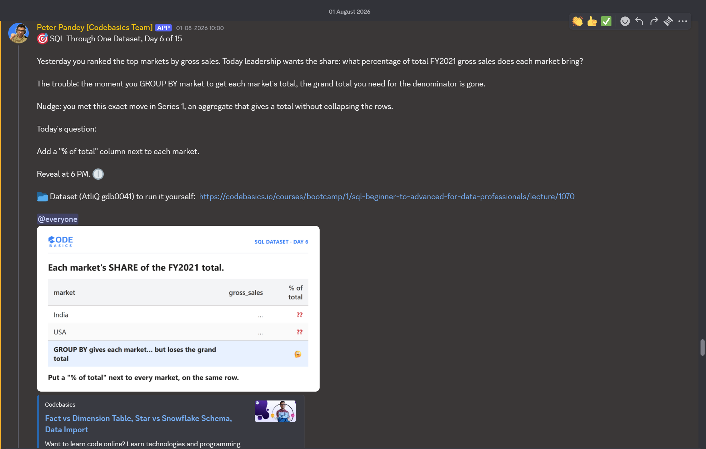

# Day 6 / 15 -- Percent of Total Without Losing the Grand Total

**Dataset:** AtliQ Hardware (`gdb0041`) | **Tool:** MySQL | **Date:** 01/08/2026

[Fix-query](./Day-6-Fix-query.sql)

---

## The Ask



Day 6 of 15, same dataset (AtliQ Hardware, `gdb0041`) as every other day in this series.

Yesterday's task ranked the top markets by gross sales. Today leadership wants the share: what percentage of total FY2021 gross sales does each market bring? Add a "% of total" column next to each market.

## The Trap

The obvious first move is to `GROUP BY market` and calculate each market's share directly inside that grouping. This runs clean, no errors. The problem is the moment you group by market, each row only knows its own market's total -- the grand total needed as the percentage's denominator disappears along with every other market's row. Trying to calculate a share with no visibility into the whole either returns the wrong number or collapses everything down to a single row.

## The Fix

Same idea used for `RANK()` on Day 5 -- a window function, which aggregates without collapsing rows:

```sql
ROUND(gsr.gross_sales_mln * 100 / SUM(gsr.gross_sales_mln) OVER(), 2) AS pct_of_total
```

`SUM(...) OVER()` with no `PARTITION BY` computes the grand total across every row in the result set, while still returning one row per market. `GROUP BY market` and `OVER()` do two different jobs together: `GROUP BY` collapses the raw sales rows down to one total per market, and `OVER()` then adds the grand total back in as a visible column on every one of those rows.

## Bonus Find: The Trap Hides Even After the Fix

Adding `OVER()` isn't automatically safe either. If `SUM(...) OVER()` runs inside the same aggregation step that produces each market's own total, the window only sees one row at a time -- there's nothing left to sum against, so every row's percentage comes out as 100%.

The fix query avoids this by running the window function as a separate step, over the already-grouped `gross_sales_report` results: first collapse to one row per market, then compute the window sum on top of that finished set. Two steps, not one.

## Why It Works

Same idea as a cricket scoreboard: team total 300, your score 45, your contribution 15%. Same match, different contribution -- you need to know both the team's total and your individual score to say what your contribution actually was. `SUM(...) OVER()` is what lets the query read the market's individual total and the grand total across all markets in the same row.

## Fix Query

```sql
WITH gross_sales_report AS (
SELECT 
    fsm.fiscal_year,
    ROUND(SUM(fsm.sold_quantity * fgp.gross_price)/1000000,2) gross_sales_mln,
    dc.market,
    RANK() OVER (ORDER BY SUM(fsm.sold_quantity * fgp.gross_price) DESC) rnk
FROM gdb0041.fact_sales_monthly fsm
JOIN dim_customer dc
    ON dc.customer_code = fsm.customer_code
JOIN fact_gross_price fgp
    ON fgp.product_code = fsm.product_code 
    AND fgp.fiscal_year = fsm.fiscal_year
WHERE fsm.fiscal_year = 2021 
GROUP BY dc.market),

grand_total_report AS (
SELECT gsr.market, gsr.gross_sales_mln, 
ROUND(gsr.gross_sales_mln * 100 / SUM(gsr.gross_sales_mln) OVER(), 2) pct_of_total
FROM gross_sales_report gsr
)

SELECT gtr.market,
gtr.gross_sales_mln,
gtr.pct_of_total
FROM grand_total_report gtr;
```

Full file: [Fix-query](./Day-6-Fix-query.sql)

## Result

Each market's FY2021 gross sales alongside its share of the total:

| market | gross_sales_mln | pct_of_total |
|---|---|---|
| India | 455.05 | 27.34 |
| USA | 264.46 | 15.89 |
| South Korea | 131.86 | 7.92 |
| Canada | 89.78 | 5.39 |
| Philippines | 80.64 | 4.84 |
| United Kingdom | 78.11 | 4.69 |
| France | 67.62 | 4.06 |
| Australia | 59.15 | 3.55 |
| China | 55.29 | 3.32 |
| Indonesia | 48.12 | 2.89 |
| Norway | 44.95 | 2.70 |
| Germany | 41.25 | 2.48 |
| Spain | 38.96 | 2.34 |

Full exported result: [Results](./Day-6-results.csv)

## Takeaway

-- `GROUP BY` collapses rows down to one per group, which is exactly right for a market's own total, but it also erases the row-level view a percentage needs. Window functions aggregate without collapsing, which is why `OVER()` is the fix here the same way it was for ranking on Day 5.
-- A window function needs to run over the full set of already-aggregated rows to produce a meaningful total. Nest it inside the same grouping step instead, and the window shrinks to just the current row -- turning every percentage into 100%.

---

**Original LinkedIn post:** [add link here]
**Dataset reference (Codebasics course):** https://codebasics.io/courses/bootcamp/1/sql-beginner-to-advanced-for-data-professionals/lecture/1070
