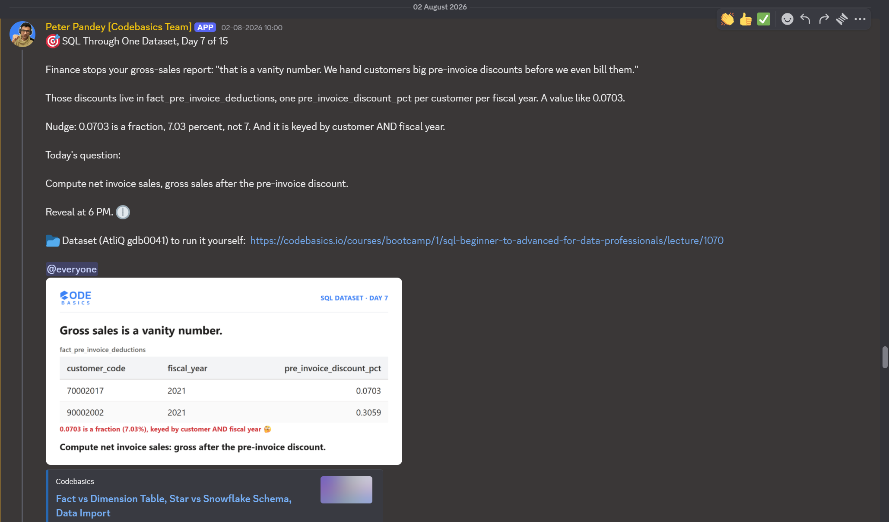

# Day 7 / 15 -- Net Invoice Sales: a Fraction, Not a Whole Number

**Dataset:** AtliQ Hardware (`gdb0041`) | **Tool:** MySQL | **Date:** 02/08/2026

[Fix-query](./Day-7-Fix-query.sql)

---

## The Ask



Day 7 of 15, same dataset (AtliQ Hardware, `gdb0041`) as every other day in this series.

Finance stopped yesterday's gross-sales report cold: gross sales is a vanity number, because customers get pre-invoice discounts before they're ever billed. Those discounts live in `fact_pre_invoice_deductions`, one `pre_invoice_discount_pct` per customer per fiscal year -- a value like `0.0703`.

Today's question: compute net invoice sales, gross sales after the pre-invoice discount.

## The Trap

`0.0703` looks like it could mean two different things, and picking the wrong one breaks the math. Read it as "7" and divide by 100 to turn it into a usable rate, and the discount collapses to roughly 0.07% instead of 7.03% -- a customer's real discount practically disappears, and net invoice sales comes out almost identical to gross sales.

## The Fix

`pre_invoice_discount_pct` is already stored as a fraction, not a whole number needing conversion. `0.0703` already means 7.03%. Apply it directly:

```sql
ROUND(gsr.gross_sales_mln * (1 - gsr.pre_invoice_discount_pct), 2) net_invoice_sales
```

No `/100` anywhere -- `(1 - discount_pct)` is the correct math the moment the value is already a fraction.

## Bonus Find: The Trap Hides Even After the Fix

Fixing the fraction isn't the whole story. `pre_invoice_discount_pct` is keyed by customer **and** fiscal year -- the same customer can have a different discount rate in a different year. `GROUP BY customer_code` alone blends every year's rate into one, ending up with a discount that doesn't correctly belong to any single year. `GROUP BY dc.customer_code, fsm.fiscal_year` together is what keeps one correct discount rate attached to its correct row.

## Why It Works

Same idea as a price tag: ₹1000 listed, you pay ₹930, a 7% discount. Same product, a different amount once the discount is actually applied. `net_invoice_sales` works the same way -- it reads the bill after the discount, not before it, and the discount rate only needs to be applied once, exactly as stored.

## Fix Query

```sql
WITH gross_sales_report AS (
	SELECT 	 
		dc.customer_code,
		dc.customer,
		dc.market,
		preivd.pre_invoice_discount_pct,
		ROUND(SUM(fsm.sold_quantity * fgp.gross_price)/1000000,2) gross_sales_mln
    FROM fact_sales_monthly fsm 
    JOIN dim_customer dc
		ON dc.customer_code = fsm.customer_code
    JOIN fact_gross_price fgp 
		ON fgp.product_code = fsm.product_code
		AND fgp.fiscal_year = fsm.fiscal_year
    JOIN fact_pre_invoice_deductions preivd
		ON preivd.customer_code = fsm.customer_code
		AND preivd.fiscal_year = fsm.fiscal_year 
    GROUP BY dc.customer_code, fsm.fiscal_year
    )
SELECT 
	 gsr.customer_code, gsr.gross_sales_mln, 
    ROUND(gsr.gross_sales_mln * (1 - gsr.pre_invoice_discount_pct), 2) net_invoice_sales
    FROM gross_sales_report gsr 
    ORDER BY gsr.gross_sales_mln DESC;
```

Full file: [fix-query.sql](./fix-query.sql)

## Result

Top customers by gross sales, alongside net invoice sales after the discount:

| customer_code | gross_sales_mln | net_invoice_sales |
|---|---|---|
| 80007196 | 103.55 | 74.33 |
| 80007195 | 99.78 | 70.55 |
| 90002008 | 84.16 | 59.65 |
| 80001019 | 73.71 | 59.76 |
| 90002009 | 57.59 | 46.68 |
| 90002004 | 54.03 | 42.67 |
| 90002016 | 53.77 | 37.52 |
| 90002012 | 53.37 | 39.29 |
| 80006155 | 53.32 | 37.65 |
| 90002015 | 51.24 | 40.19 |
| 90002007 | 50.31 | 37.23 |

25 rows returned in total (full result exported below).

Full exported result: [Results](./Day-7-results.csv)

## Takeaway

-- A decimal like `0.0703` isn't automatically "7 that needs dividing by 100." Check what the column actually stores before applying any conversion -- here it was already the fraction, and converting it again wrecked the number.
-- When a rate or rule is keyed by more than one column (customer AND fiscal year here), grouping by only one of them silently blends values that were never meant to be combined.

---

**Original LinkedIn post:** [Linkedin-post-URL](https://www.linkedin.com/posts/vishnu-ram-sachin-d-_day-7-learnings-by-sachin-activity-7489948356048285696-oVXG?utm_source=share&utm_medium=member_desktop&rcm=ACoAAD-YjK4B1ekkuKaP0cSvVwYi6kAAiCTAQhY)
