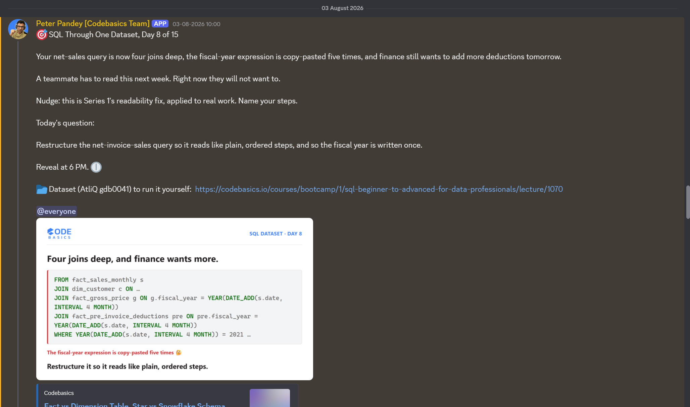

# Day 8 / 15 -- Readability Is Not Cosmetic

**Dataset:** AtliQ Hardware (`gdb0041`) | **Tool:** MySQL | **Date:** 03/08/2026

[View-fix-query](./Day-8-Fix-query.sql)

---

## The Ask



Day 8 of 15, same dataset (AtliQ Hardware, `gdb0041`) as every other day in this series.

Yesterday's net-invoice-sales query works, but it's grown into a problem of its own: four joins deep, the fiscal-year expression copy-pasted five times, and finance wants to add more deductions tomorrow. A teammate has to read this next week, and right now they will not want to.

Today's question isn't about wrong output -- it's about restructuring the query so it reads like plain, ordered steps, with the fiscal year written once.

## The Trap

This one doesn't return the wrong numbers. It runs fine and gives the correct answer -- the trap is what happens the next time someone has to touch it. One large nested block hides where each step actually begins and ends. The fiscal-year condition shows up five separate times across the query, so a future change means finding and editing all five correctly, and one missed edit quietly breaks a join without throwing an error.

## The Fix

Break the single nested block into named CTEs, one job per step:

-- `sales_report` -- scope the raw sales rows
-- `gross_sales_report` -- attach the price, sum to gross
-- `pre_invoice_report` -- attach the deduction %
-- final `SELECT` -- combine everything, compute net sales

Each CTE does exactly one thing, and the fiscal-year join condition is written once per step it's actually needed in, instead of copy-pasted throughout a single block.

## Bonus Find: Readability Has a Direct Cost

Readability isn't a style preference -- it's the time your next teammate spends understanding your logic before they can safely change it. With one nested block, adding a new deduction means editing inside that block, hunting for the right spot without breaking anything else. With separate CTEs that each have one job, adding a new deduction is just one more CTE -- it doesn't require touching what already works.

## Why It Works

Same idea as a water purification plant with four stages, each doing one job in one direction:

1. **Sediment filter** -- removes dirt from raw water (`sales_report`)
2. **Carbon filter** -- removes chlorine and odor (`gross_sales_report`)
3. **RO membrane** -- removes dissolved salts (`pre_invoice_report`)
4. **UV purifier** -- kills bacteria, clean water out (final `SELECT`)

Water flows through in one direction, one stage doing one job, and each stage can be inspected or swapped without re-plumbing the whole plant. The query works the same way once it's broken into named steps.

## Fix Query

```sql
WITH sales_report AS (
SELECT 	fsm.date, fsm.fiscal_year, fsm.product_code,
fsm.customer_code, fsm.sold_quantity
FROM fact_sales_monthly fsm ),

gross_sales_report AS (
SELECT 
  sr.customer_code, sr.fiscal_year,
ROUND(SUM(sr.sold_quantity * fgp.gross_price)/1000000,2) gross_sales_mln
FROM sales_report sr 
JOIN fact_gross_price fgp
ON sr.product_code = fgp.product_code 
AND sr.fiscal_year = fgp.fiscal_year 
GROUP BY sr.customer_code, sr.fiscal_year) ,

pre_invoice_report AS (                             
    SELECT 
        preivd.customer_code, 
        preivd.fiscal_year,
        preivd.pre_invoice_discount_pct
    FROM fact_pre_invoice_deductions preivd
)

SELECT                                              
    gsr.customer_code, 
    gsr.gross_sales_mln, 
    ROUND(gsr.gross_sales_mln * (1 - pir.pre_invoice_discount_pct),2) net_invoice_sales
FROM gross_sales_report gsr 
JOIN pre_invoice_report pir
    ON pir.customer_code = gsr.customer_code
    AND pir.fiscal_year = gsr.fiscal_year
ORDER BY gsr.gross_sales_mln DESC;
```

Full file: [View-fix-query](./Day-8-Fix-query.sql)

## Result

Same correct output as Day 7, now from a query a teammate can actually follow:

| customer_code | gross_sales_mln | net_invoice_sales |
|---|---|---|
| 80007196 | 103.55 | 74.33 |
| 80007195 | 99.78 | 70.55 |
| 90002008 | 84.16 | 59.65 |
| 80001019 | 73.71 | 59.76 |
| 90002009 | 57.59 | 46.68 |
| 90002004 | 54.03 | 42.67 |
| 90002016 | 53.77 | 37.52 |
| 90002012 | 53.37 | 39.29 |
| 80006155 | 53.32 | 37.65 |
| 90002015 | 51.24 | 40.19 |
| 90002007 | 50.31 | 37.23 |
| 90002011 | 49.70 | 40.03 |
| 90002003 | 49.26 | 35.14 |
| 80007196 | 48.69 | 34.96 |
| 80007195 | 48.25 | 35.62 |

Same customer codes reappear with different figures further down -- that's the same customer in a different fiscal year, which is exactly what `GROUP BY customer_code, fiscal_year` is meant to keep separate.

Full exported result: [Results](./Day-8-results.csv)

## Takeaway

-- Readability isn't cosmetic. It's the difference between a teammate confidently extending a query and being afraid to touch it. Named CTEs with one job each turn "where do I make this change" into an obvious answer.
-- If the same expression shows up in more than one place in a query, that's a sign the query needs restructuring, not just cleanup -- one missed edit during a future change can silently break the logic without an error to catch it.

---

**Original LinkedIn post:** [Linkedin-post-URL](https://www.linkedin.com/posts/vishnu-ram-sachin-d-_day-8-learnings-by-sachin-activity-7490297179677343744-3M_L?utm_source=share&utm_medium=member_desktop&rcm=ACoAAD-YjK4B1ekkuKaP0cSvVwYi6kAAiCTAQhY)

