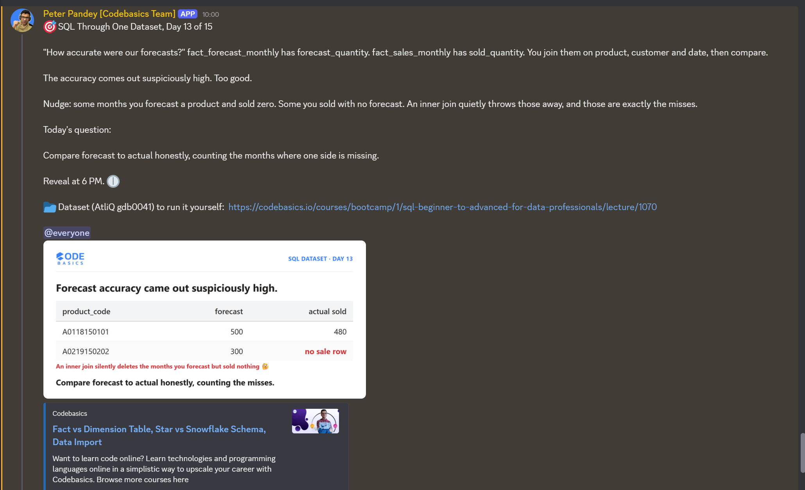

# Day 13 / 15 -- Forecast vs Actuals, Counting What Went Missing

**Dataset:** AtliQ Hardware (`gdb0041`) | **Tool:** MySQL | **Date:** 08/08/2026

[View fix-query](./Day-13-Fix-query.sql)

---

## The Ask



Day 13 of 15, same dataset (AtliQ Hardware, `gdb0041`) as every other day in this series.

Yesterday's fix was about a running total resetting on the right calendar. Today, leadership wants something different: an honest forecast vs actuals comparison, per product per month. `fact_forecast_monthly` holds what we planned to sell (`forecast_quantity`), `fact_sales_monthly` holds what we actually sold (`sold_quantity`).

Today's question: compare forecast to actual honestly, counting the months where one side is missing.

## The Trap

The obvious first move is to join both fact tables on `date`, `customer_code`, and `product_code`, then compare the two quantity columns. It runs fine and returns numbers -- and the accuracy comes out suspiciously high. Too good.

An `INNER JOIN` only keeps a row if it exists on **both** sides. That quietly drops exactly the two situations that matter most:

- **Forecasted, zero sold** -- a product we planned for but never actually sold that month. Dropped.
- **Sold, never forecast** -- a product that sold with no forecast on record at all. Dropped.

Both of those are misses. Removing them before the comparison even runs is what was inflating the accuracy number -- not because the forecasting was good, but because the query was silently only grading itself on the months it agreed with.

## The Fix

MySQL has no `FULL OUTER JOIN`, so the fix is to build one: two `LEFT JOIN`s combined with `UNION ALL`, not a single `INNER JOIN`.

```
FROM fact_sales_monthly fsm
LEFT JOIN fact_forecast_monthly ffm
    UNION ALL
FROM fact_forecast_monthly ffm
LEFT JOIN fact_sales_monthly fsm
    WHERE fsm.product_code IS NULL
```

The first branch keeps every sold month, even ones with zero forecast. The second branch adds back forecast-only months that never matched a sale, filtered with `WHERE fsm.product_code IS NULL` so the same row never gets counted twice between the two branches.

Getting there wasn't a straight line -- along the way I ran into query timeouts on the full 1.8M+ row forecast table (traced back to a missing index on the join columns) and a column order mismatch between the two branches of the `UNION`. Stuck in the middle of it more than once, but worked through each one before landing on the fix below.

## Why It Works

Think of it like matching a guest list against actual attendance at an event. If you only count people who both RSVP'd *and* showed up, you invisibly drop two important groups: the ones who RSVP'd but never came, and the ones who showed up without RSVPing. Counting only the overlap gives you a clean-looking number that hides exactly the two stories worth knowing.

`LEFT JOIN` from the sales side keeps every person who showed up, whether or not they RSVP'd. `LEFT JOIN` from the forecast side, filtered down to only the no-shows, adds back everyone who RSVP'd but never came. Stitched together, nothing from either list gets silently dropped -- the honest count includes both kinds of mismatch, not just the matches.

## Fix Query

```sql
WITH forecast_actual_compare_report AS (
    SELECT
        fsm.date,
        MONTHNAME(fsm.date) AS month_name,
        fsm.customer_code,
        fsm.product_code,
        fsm.fiscal_year,
        COALESCE(ffm.forecast_quantity, 0) AS forecast_quantity,
        fsm.sold_quantity
    FROM fact_sales_monthly AS fsm
    LEFT JOIN fact_forecast_monthly AS ffm
        ON fsm.date = ffm.date
        AND fsm.customer_code = ffm.customer_code
        AND fsm.product_code = ffm.product_code

    UNION ALL

    SELECT
        ffm.date,
        MONTHNAME(ffm.date) AS month_name,
        ffm.customer_code,
        ffm.fiscal_year,
        ffm.product_code,
        ffm.forecast_quantity,
        0 AS sold_quantity
    FROM fact_forecast_monthly AS ffm
    LEFT JOIN fact_sales_monthly AS fsm
        ON ffm.date = fsm.date
        AND ffm.customer_code = fsm.customer_code
        AND ffm.product_code = fsm.product_code
    WHERE fsm.product_code IS NULL
)
SELECT
    facr.month_name,
    facr.fiscal_year,
    facr.customer_code,
    facr.product_code,
    facr.forecast_quantity,
    facr.sold_quantity,
    (forecast_quantity - sold_quantity) AS forecast_error
FROM forecast_actual_compare_report facr;
```

Full file: [View fix-query](./Day-13-Fix-query.sql)

## Result

A preview from September 2018, fiscal year 2018:

| month_name | fiscal_year | customer_code | product_code | forecast_quantity | sold_quantity | forecast_error |
|---|---|---|---|---|---|---|
| September | 2018 | 70002017 | A0118150101 | 18 | 51 | -33 |
| September | 2018 | 70002018 | A0118150101 | 11 | 77 | -66 |
| September | 2018 | 70003181 | A0118150101 | 9 | 17 | -8 |
| September | 2018 | 70003182 | A0118150101 | 6 | 6 | 0 |
| September | 2018 | 70006157 | A0118150101 | 5 | 5 | 0 |
| September | 2018 | 70006158 | A0118150101 | 6 | 7 | -1 |
| September | 2018 | 70007198 | A0118150101 | 4 | 29 | -25 |
| September | 2018 | 70007199 | A0118150101 | 7 | 34 | -27 |
| September | 2018 | 70008169 | A0118150101 | 7 | 22 | -15 |
| September | 2018 | 70008170 | A0118150101 | 8 | 5 | 3 |

Negative `forecast_error` means we sold more than forecast (under-forecasted); positive means we sold less than forecast (over-forecasted). Rows like 70003182 and 70006157, where forecast and sold match exactly, show up alongside the misses -- exactly the kind of row an inner join would have hidden either way.

Full exported result: [Results](./Day-13-results.csv)

## Takeaway

-- A join isn't just how you combine two tables, it's also a filter on what survives to the final result. `INNER JOIN` looks clean but silently drops any row that doesn't have a match on both sides.
-- MySQL has no `FULL OUTER JOIN`, but `LEFT JOIN` from each side, combined with `UNION ALL` and a `WHERE ... IS NULL` filter to prevent double-counting, reconstructs the same honest result. If the numbers look too good, check what got quietly dropped before trusting them.

---

**Original LinkedIn post:** [Linkedin-post-url](https://www.linkedin.com/posts/vishnu-ram-sachin-d-_day-13-learnings-by-sachin-activity-7491830827341729793-jsSu?utm_source=share&utm_medium=member_desktop&rcm=ACoAAD-YjK4B1ekkuKaP0cSvVwYi6kAAiCTAQhY)
