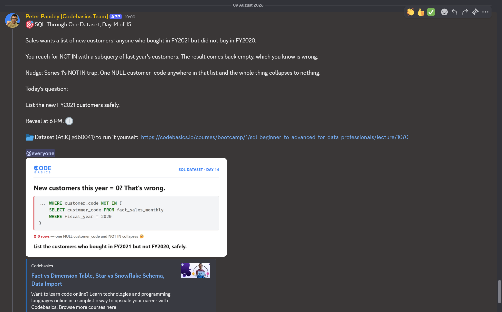

# Day 14 / 15 -- New Customers, and a Zero Worth Verifying

**Dataset:** AtliQ Hardware (`gdb0041`) | **Tool:** MySQL | **Date:** 09/08/2026

[View fix-query](./Day-14-Fix-query.sql)

---

## The Ask



Day 14 of 15, same dataset (AtliQ Hardware, `gdb0041`) as every other day in this series.

Yesterday's fix rebuilt an honest forecast vs actuals comparison using two `LEFT JOIN`s instead of a silently-filtering `INNER JOIN`. Today, Sales wants something simpler on the surface: a list of new FY2021 customers -- anyone who bought in FY2021 but did not buy in FY2020.

## The Trap

The obvious first move is `NOT IN` with a subquery of last year's customers:

```sql
SELECT customer_code
FROM fact_sales_monthly
WHERE fiscal_year = 2021
AND customer_code NOT IN (
    SELECT customer_code
    FROM fact_sales_monthly
    WHERE fiscal_year = 2020
);
```

It runs, and it comes back with **0 rows**. Same signature as the `NOT IN` trap from earlier in this series: `NOT IN` unpacks into a chain of `<> ALL` comparisons, and SQL uses three-valued logic (`TRUE` / `FALSE` / `UNKNOWN`). If even one `customer_code` in that FY2020 subquery is `NULL`, every comparison against it evaluates to `UNKNOWN` instead of `TRUE`. Since the whole chain needs every comparison to hold for `NOT IN` to return `TRUE`, a single `UNKNOWN` poisons the entire result -- every row gets excluded, correct customers included. No error, no warning. Just a wrong answer that looks exactly like a right one.

## The Fix

`NOT EXISTS`, correlated against the FY2020 rows directly instead of matching against a static list:

```sql
SELECT DISTINCT fy21.customer_code
FROM fact_sales_monthly fy21
WHERE fy21.fiscal_year = 2021
AND NOT EXISTS (
    SELECT 1
    FROM fact_sales_monthly fy20
    WHERE fy21.customer_code = fy20.customer_code
    AND fy20.fiscal_year = 2020
);
```

Getting there wasn't a straight line -- an early CTE version selected a `COUNT()` into the intermediate result instead of the raw `customer_code` values, which broke the outer comparison since there was no column left to join back on. Adding a `dim_customer` join inside the correlated subquery also pushed one run past MySQL's 60-second timeout. Dropping back to a plain, two-table `NOT EXISTS` without the extra join is what finally ran clean.

## Why It Works

`NOT IN` builds one static list up front and checks every row against that whole list at once -- if one entry on the list is unreadable (`NULL`), the whole list becomes untrustworthy for every comparison, not just that one entry.

`NOT EXISTS` never builds a list. It checks each FY2021 customer individually, asking "does a matching row exist for this specific person in FY2020?" one row at a time. A `NULL` sitting somewhere else in the table has nothing to do with that individual check, so it can't poison it. Correlated, row-by-row, immune to the trap by construction.

## Fix Query

```sql
SELECT DISTINCT fy21.customer_code
FROM fact_sales_monthly fy21
WHERE fy21.fiscal_year = 2021
AND NOT EXISTS (
    SELECT 1
    FROM fact_sales_monthly fy20
    WHERE fy21.customer_code = fy20.customer_code
    AND fy20.fiscal_year = 2020
);
```

Full file: [View fix-query](./Day-14-Fix-query.sql)

## Result

**0 rows returned.**

Unlike the `NOT IN` version, this zero isn't just assumed correct -- it's checked. Before trusting it, I ran the fiscal-year customer counts and an overlap check:

```sql
SELECT fsm.fiscal_year,
    COUNT(DISTINCT(fsm.customer_code)) AS fy_unique_customers
FROM fact_sales_monthly fsm
WHERE fsm.fiscal_year IN (2020,2021)
GROUP BY fsm.fiscal_year;
```

| fiscal_year | fy_unique_customers |
|---|---|
| 2020 | 209 |
| 2021 | 209 |

Equal counts alone don't prove it's the same 209 people in both years -- two different sets of 209 would look identical here. So the overlap itself needed checking too:

```sql
SELECT COUNT(DISTINCT customer_code) AS in_both
FROM fact_sales_monthly s21
WHERE fiscal_year = 2021
AND customer_code IN (
    SELECT customer_code FROM fact_sales_monthly WHERE fiscal_year = 2020
);
```

**`in_both` = 209.** All 209 FY2021 customers matched back into FY2020 -- full overlap, not a coincidence of matching counts. Combined with `NOT EXISTS` independently returning 0 rows across multiple runs, the zero is verified from three separate directions, not just taken at face value.

Full exported result: [Results](./Day-14-results.csv)

## Takeaway

-- `NOT IN` silently breaks the moment a `NULL` reaches its subquery -- three-valued logic means one unreadable value poisons every comparison, and it fails without an error, not with one. `NOT EXISTS` (or a `LEFT JOIN` / `IS NULL` anti-join) checks row by row instead of matching against a static list, so there's no list for a `NULL` to poison.
-- A correct query and a broken query can return the exact same output. Today, both `NOT IN` and `NOT EXISTS` returned 0 rows -- the difference wasn't what was on screen, it was whether the zero could be trusted. Equal counts across two groups don't prove the groups share members either; that took an explicit overlap check to confirm. Verifying a suspicious result is as much a part of the fix as writing the correct query.

---

**Original LinkedIn post:** *(add link once posted)*
