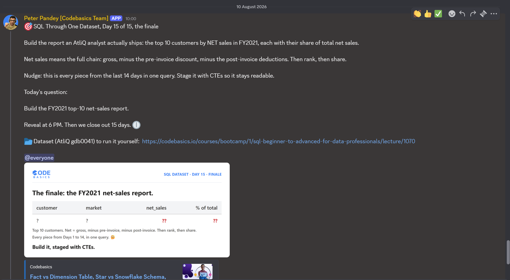

# Day 15 / 15 -- The Finale, a Report an AtliQ Analyst Actually Ships

**Dataset:** AtliQ Hardware (`gdb0041`) \| **Tool:** MySQL \| **Date:**
10/08/2026

[View fix-query](./Day-15-Fix-query.sql)

------------------------------------------------------------------------

## The Ask


Day 15 of 15. Same dataset (AtliQ Hardware, `gdb0041`) as every other
day in this series.

For the finale, the ask is no longer one isolated SQL problem. Sales
wants a report an AtliQ analyst could actually ship: the **top 10
customers by NET sales in FY2021**, with each customer's **share of
total net sales**.

The important part is what "NET sales" means here. It is the full chain:

**Gross sales → pre-invoice discount → post-invoice deductions → net
sales**

Then the report needs to:

1.  Aggregate net sales at the customer level.
2.  Rank the customers by net sales.
3.  Calculate each customer's share of the total net sales.
4.  Return the top 10.

The prompt's nudge for today is the point of the finale: **every piece
from the last 14 days comes together in one query.** To keep that query
readable, the logic is staged with CTEs.

## The Build

The report is built as a sequence of five CTEs rather than one large
block:

``` text
gross_sales_report
        | 
net_invoice_sales_report
        |
net_sales_report
        |
customer_sales_report
        |
ranked_report
        |
final SELECT
```

Each stage has one job.

### 1. `gross_sales_report`

Start with the FY2021 raw sales rows and attach the corresponding gross
price.

``` sql
fsm.sold_quantity * fgp.gross_price AS gross_sales_mln
```

This gives the report its gross-sales foundation.

### 2. `net_invoice_sales_report`

Apply the customer-level pre-invoice deduction:

``` sql
gross_sales_mln * (1 - fpid.pre_invoice_discount_pct)
    AS net_invoice_sales
```

Gross sales are now reduced to net invoice sales.

### 3. `net_sales_report`

Apply the post-invoice deductions:

``` sql
net_invoice_sales * (1 - (fpoid.discounts_pct + fpoid.other_deductions_pct))
    AS net_sales
```

This is the final net-sales value used for the report.

### 4. `customer_sales_report`

The report is about customers, not individual transactions, so the net
sales are aggregated:

``` sql
ROUND(SUM(nsr.net_sales)/1000000,2) AS net_sales_mln
```

and grouped by customer.

### 5. `ranked_report`

Finally, rank the customers and calculate their share of total net
sales:

``` sql
RANK () OVER (ORDER BY csr.net_sales_mln DESC) AS rank_order,

ROUND(
    csr.net_sales_mln * 100 /
    SUM(csr.net_sales_mln) OVER (),
    2
) AS pct_of_total
```

The final filter then keeps only:

``` sql
WHERE rank_order <= 10
```

The important detail is that the percentage is calculated against the
total from the complete `customer_sales_report` before the final Top-10
filter is applied.

## Fix Query

``` sql
WITH gross_sales_report AS (
    SELECT dc.customer, dc.market , fsm.fiscal_year , fsm.product_code, 
        fsm.customer_code, fsm.date,
        fsm.sold_quantity * fgp.gross_price AS gross_sales_mln
    FROM fact_sales_monthly fsm 
    JOIN fact_gross_price fgp 
        ON fsm.product_code = fgp.product_code
        AND fsm.fiscal_year = fgp.fiscal_year
    JOIN dim_customer dc
        ON fsm.customer_code = dc.customer_code
    WHERE fsm.fiscal_year = 2021
),

net_invoice_sales_report AS (
    SELECT gsr.customer , gsr.fiscal_year , 
        gsr.market, gsr.customer_code, gsr.product_code, gsr.date, 
        gsr.gross_sales_mln * (1 - fpid.pre_invoice_discount_pct) AS net_invoice_sales
    FROM gross_sales_report gsr
    JOIN fact_pre_invoice_deductions fpid 
        ON gsr.customer_code = fpid.customer_code 
        AND gsr.fiscal_year = fpid.fiscal_year
),

net_sales_report AS (
    SELECT nisr.customer, nisr.fiscal_year, nisr.market, 
        nisr.customer_code, nisr.date,
        nisr.net_invoice_sales * (1- (fpoid.discounts_pct + fpoid.other_deductions_pct))
        AS net_sales
    FROM net_invoice_sales_report nisr
    JOIN fact_post_invoice_deductions fpoid
        ON nisr.customer_code = fpoid.customer_code
        AND nisr.product_code = fpoid.product_code
        AND nisr.date = fpoid.date
),

customer_sales_report AS (
    SELECT nsr.customer_code, nsr.customer, nsr.market, 
        ROUND(SUM(nsr.net_sales)/1000000,2) AS net_sales_mln
    FROM net_sales_report nsr 
    GROUP BY nsr.customer_code, nsr.customer , nsr.market
),

ranked_report AS (
    SELECT csr.customer, csr.market, csr.net_sales_mln ,
        RANK () OVER (ORDER BY csr.net_sales_mln DESC ) AS rank_order, 
        ROUND(csr.net_sales_mln*100/ SUM(csr.net_sales_mln) OVER (),2) 
        AS pct_of_total
    FROM customer_sales_report csr
)

SELECT  
    rr.customer, rr.market , rr.net_sales_mln  , rr.pct_of_total , rr.rank_order
FROM ranked_report rr
WHERE rank_order <=10
ORDER BY rank_order ASC;
```

Full file: [View fix-query](./Day-15-Fix-query.sql)

## Result

The final output is the **FY2021 top 10 customers by net sales**, with:

-   Customer
-   Market
-   Net sales (million)
-   Percentage of total net sales
-   Rank

**Final exported result:**

[Results](./Day-15-results.csv)

## Verification

The final report is not only about finding the largest customers. It
also needs to preserve the meaning of the percentage column.

`RANK()` orders customers by their aggregated FY2021 net sales.

The windowed `SUM()` calculates the denominator across the full
customer-level report:

``` sql
SUM(csr.net_sales_mln) OVER ()
```

Only after those calculations are made does the final query filter to
the top 10:

``` sql
WHERE rank_order <=10
```

That keeps `pct_of_total` as each customer's share of **total FY2021 net
sales**, rather than their share of only the top 10.

## Takeaway

-- Day 15 is the point where the individual SQL concepts stop being
separate exercises and become one reporting workflow: build the sales
base, attach the deductions, calculate true net sales, aggregate to
customers, rank them, and calculate their share of the total.

-- The value of the final query is not just the `RANK()` or the
`LIMIT`-style Top 10 output. The report only becomes meaningful when the
entire net-sales chain is preserved and the percentage is calculated
against the full customer-level total before the Top 10 filter is
applied.

-- The bigger lesson from the 15-day challenge is that SQL is not only
about writing a query that runs. It is about building a chain of logic
where each step produces the right input for the next one -- and where
the final output can answer a real business question.

------------------------------------------------------------------------

**Original LinkedIn post:** [LinkedIn-post-URL](./Linkedin-post-URL)
